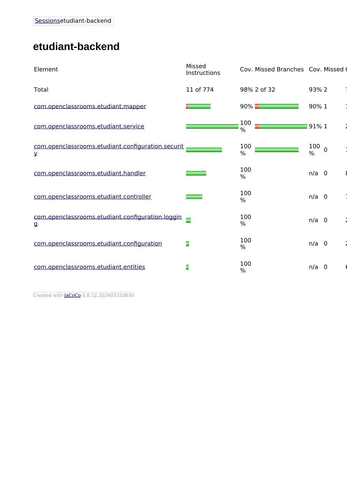
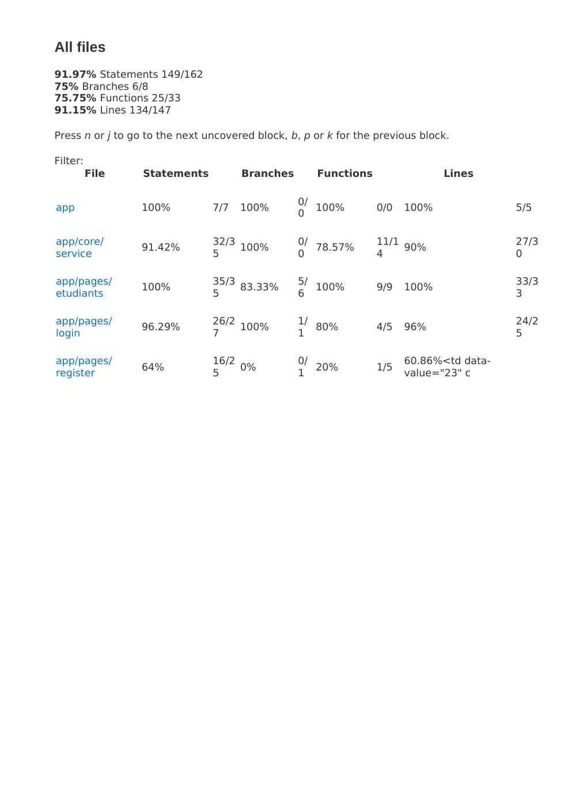

# EtuBibliothèque — Testez et améliorez une application existante

Projet 2 du parcours **Expert DevOps** (OpenClassrooms) — JAIEL Ilyasse.

Application full-stack **EtuBibliothèque** (gestion des étudiants d'une bibliothèque) :
correction de l'API d'authentification (JWT), ajout d'un **CRUD étudiants** et mise en place
de **tests automatisés** aux trois niveaux (unitaires, intégration, end-to-end).

## Stack

| Côté | Technologies |
| --- | --- |
| Back-end | Java 21, Spring Boot 3.5, Spring Security (JWT), Spring Data JPA, MapStruct, MySQL |
| Front-end | Angular 19, Angular Material |
| Tests | JUnit 5, Mockito, Testcontainers (back) · Jest (front) · Cypress (E2E) · JaCoCo (couverture) |

## Structure du dépôt

```
.
├── back/            # API Spring Boot (Java)
│   └── src/
│       ├── main/    # code (controllers, services, repositories, entities, security JWT)
│       └── test/    # tests unitaires (JUnit/Mockito) et d'intégration (Testcontainers)
├── front/           # application Angular
│   ├── src/app/     # composants & services (+ specs Jest *.spec.ts)
│   └── cypress/e2e/ # tests end-to-end (login.cy.ts, etudiants.cy.ts)
└── docs/coverage/   # captures des rapports de couverture
```

## Fonctionnalités

- **Authentification** : `/api/register`, `/api/login` (renvoie un **JWT** HS256), filtre JWT + guard front.
- **CRUD étudiants** : `/api/etudiants` (liste, détail, ajout, édition, suppression) — routes protégées.
- **Front** : écran de connexion + écrans de gestion des étudiants (Angular Material).

## Démarrage

### Back-end (port 8080, MySQL via Docker)
```bash
cd back
mvn spring-boot:run
```

### Front-end (port 4200)
```bash
cd front
npm install
npm start
```

## Tests & couverture

### Back-end
```bash
cd back
mvn verify          # 46 tests · rapport JaCoCo : back/target/site/jacoco/index.html
```

### Front-end
```bash
cd front
npm test            # Jest + couverture : front/coverage/index.html
npm run e2e:run     # Cypress (E2E) — headless
```

### Résultats (seuil OpenClassrooms : 80 % minimum)

**Back-end — JaCoCo** : Instructions **98,6 %** · Branches **93,8 %** · Lignes **98,9 %** · Méthodes **100 %** (46 tests, 0 échec).



**Front-end — Jest** : Statements **91,97 %** · Lignes **91,15 %** (login 96 %, étudiants 100 %). E2E : **Cypress 6/6**.



## Correspondance avec les livrables attendus

| Livrable OpenClassrooms | Où le trouver |
| --- | --- |
| Code front-end et back-end avec les fonctionnalités requises | `back/src/main`, `front/src/app` |
| Tous les tests unitaires + intégration (front & back) + E2E | `back/src/test`, `front/src/**/*.spec.ts`, `front/cypress/e2e` |
| Rapports de couverture indiquant ≥ 80 % | `docs/coverage/` (captures) + générables via `mvn verify` / `npm test` |
